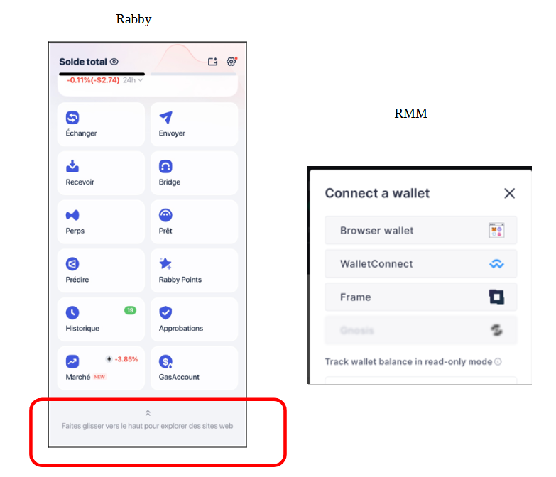

# Rabby

Pour passer de MetaMask à Rabby :



## Version mobile

Rabby existe en version mobile depuis peu (2024).\
Il n'est pas possible de se connecter via WalletConnect, en scannant le QR code de l'application.\
Il est juste possible d'accéder à l'application, via le navigateur intégré à Rabby (exemple ci-dessous pour accéder au RMM, via l'option "browser wallet" sur RMM : &#x20;

<figure><figcaption></figcaption></figure>

