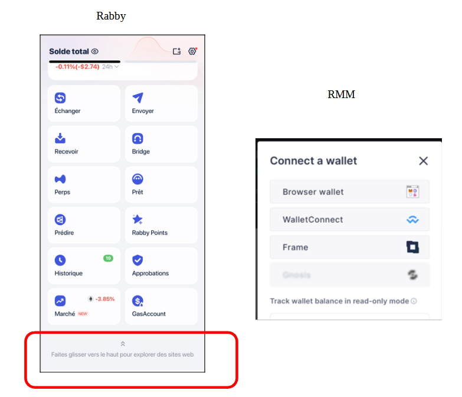

# Factoring

Dans les échanges entre entreprises, le règlement des factures se fait généralement avec un délais de paiement (cf schéma : étape 1, 2, 3, 6bis).

<figure><figcaption></figcaption></figure>

L’entreprise fournisseur peut obtenir un règlement plus rapide de ses factures en utilisant les services de Factoring (Affacturage en français). Elle cède alors sa créance (droit à être payé) à l’affactureur (étape 4) et reçoit le paiement réduit d'une commission (étape 5)\
L’entreprise cliente, règle à l’échéance la facture à l’affactureur (étape 6).\
C’est l’affactureur (voir son financeur : RealT en l’occurrence) qui porte alors le risque d’impayé de l’entreprise cliente.&#x20;

Plus les risques d’impayé sont élevés, plus la commission d’affacturage l'est aussi. Les Realtokens de factoring sont classés (de A à K) suivant le risque d’impayé.

L'affacturage peut être, avec ou sans recours :&#x20;

* sans recours : l'affactureur et RealT sont les seuls à porter le risque d'impayé. La commission d'affacturage est alors plus élevé. C'est l'option retenue par RealT pour commencer, avec des risques modérés (classe B et C). RealT devra alors se retourner vers le débiteur pour obtenir le règlement.
* avec recours : l'affactureur peut se retourner auprès de l'entreprise fournisseur pour être réglé. Les frais d'affacturage sont alors plus faible.

Des informations détaillées (affactureur, factures traitées, commissions d'affacturage,..) sont disponibles pour le premier token (pour les suivants, les affactureurs seraient réticents à un tel niveau de communication)\
[https://realt.co/product/realt-factoring-ps-sc-1#tab-title-factoring\_invoices\_tab](https://realt.co/product/realt-factoring-ps-sc-1#tab-title-factoring_invoices_tab)

<figure><figcaption></figcaption></figure>

Présentation par RealT lors du CC du 1er Mai 2025 : [https://youtu.be/QCuzZm6CGJM?t=2640](https://youtu.be/QCuzZm6CGJM?t=2640)
